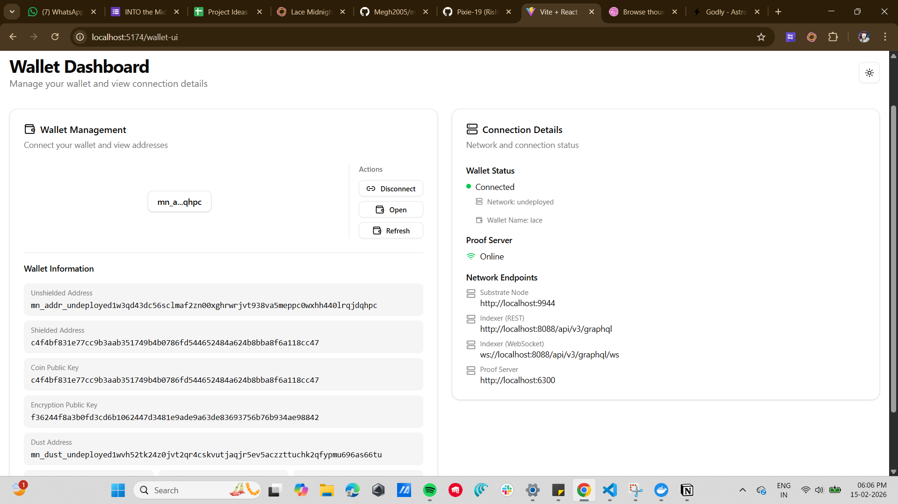

<div align="center">

# 🛡️ Anon Incident Report



### Report local incidents anonymously on-chain with zero-knowledge location proofs

[](https://midnight.network)
[](https://docs.midnight.network)
[](LICENSE)

</div>

---

## 📖 What is Anon Incident Report?

**Anon Incident Report** is a privacy-first decentralized application that lets residents report local incidents — such as noise complaints, safety hazards, or vandalism — **anonymously on-chain**. Authorities can verify that a report is legitimate without ever learning the reporter's identity.

Built on the [Midnight Network](https://midnight.network), the app uses **zero-knowledge proofs** to ensure:

- **Reporters stay anonymous** — no wallet address, IP, or identity is ever linked to a report.
- **Reports are tamper-proof** — once submitted, a report cannot be altered or deleted.
- **Authorities can verify legitimacy** — location proofs can be checked without revealing who filed the report.

> Think of it as a **privacy-preserving 311 system** powered by blockchain and ZK cryptography.

---

## ✨ Features

| Feature | Description |
|---|---|
| 🔒 **Anonymous Reporting** | Submit incident reports without revealing your identity |
| 🗺️ **Location Proof Verification** | Prove you were at the incident location without exposing it publicly |
| 🧮 **On-Chain Report Counter** | Transparent, public count of total reports submitted |
| 🔍 **Report Existence Verification** | Authorities can verify a report was genuinely submitted |
| 🚫 **Duplicate Prevention** | Smart contract rejects duplicate report submissions |
| ⛓️ **Fully Decentralized** | No central server — all logic runs on Midnight Network |

---

## 🏗️ How It Works

```
┌─────────────────┐       ┌──────────────────────┐       ┌─────────────────┐
│   Resident       │       │   Midnight Network   │       │   Authority      │
│                  │       │                      │       │                  │
│  1. Hash incident│──────▶│  submitReport(hash)  │       │                  │
│     data + loc   │       │  ✓ Check uniqueness  │       │                  │
│     proof locally│       │  ✓ Store in Set      │       │  3. Verify report│
│                  │       │  ✓ Increment counter │◀──────│     exists       │
│  2. Submit hash  │       │                      │       │     on-chain     │
│     on-chain     │       │  verifyReport(hash)  │       │                  │
└─────────────────┘       └──────────────────────┘       └─────────────────┘
```

1. **Resident** hashes their incident data (description, photos, etc.) and location proof locally
2. **Smart contract** stores only the hash on-chain — no personal data ever touches the blockchain
3. **Authority** can verify a report exists by checking the hash against the on-chain Set

---

## 📋 Smart Contract

Written in **Compact** (Midnight's zero-knowledge smart contract language):

```compact
export ledger totalReports: Counter;
export ledger reportIds: Set<Bytes<32>>;

export circuit submitReport(reportId: Bytes<32>): [] {
  assert(!reportIds.member(reportId), "report already submitted");
  reportIds.insert(reportId);
  totalReports.increment(1);
}

export circuit verifyReport(reportId: Bytes<32>): Boolean {
  return reportIds.member(reportId);
}
```

### Deployed Smart Contract

```
Contract Address: d25450474762eec5f5cd73df503835041bc8fd3134dc360fccda75a501c37055
Network: Midnight Undeployed (Local Devnet)
```

---

## 📦 Prerequisites

- [Node.js](https://nodejs.org/) (v23+) & [npm](https://www.npmjs.com/) (v11+)
- [Docker](https://docs.docker.com/get-docker/)
- [Git LFS](https://git-lfs.com/) (for large files)
- [Compact](https://docs.midnight.network/relnotes/compact-tools) (Midnight developer tools)
- [Lace](https://chromewebstore.google.com/detail/hgeekaiplokcnmakghbdfbgnlfheichg?utm_source=item-share-cb) (Browser wallet extension)
- [Faucet](https://faucet.preview.midnight.network/) (Preview Network Faucet)

---

## 🛠️ Setup

### 1. Clone & Install

```bash
git clone https://github.com/your-username/anon-incident-report.git
cd anon-incident-report
npm install
```

### 2. Install Compact Tools

```bash
curl --proto '=https' --tlsv1.2 -LsSf \
  https://github.com/midnightntwrk/compact/releases/latest/download/compact-installer.sh | sh
```

### 3. Compile the Smart Contract

```bash
cd counter-contract
npm run compile:neighbour
```

### 4. Start the Local Network

```bash
# Start Midnight local devnet (Docker containers)
cd midnight-local-network
docker compose up -d
```

### 5. Fund Your Wallet

```bash
cd midnight-local-network
npm run fund <your-wallet-address>
```

### 6. Build & Deploy

```bash
cd counter-contract
npm run build
npm run deploy
```

---

## 📁 Project Structure

```
anon-incident-report/
├── counter-contract/          # Smart contract (Compact + deployment scripts)
│   ├── src/
│   │   ├── neighbour.compact  # Main smart contract
│   │   ├── deploy.ts          # Deployment script
│   │   └── managed/           # Compiled contract artifacts
│   └── deployment.json        # Deployed contract address
├── counter-cli/               # CLI tools for interacting with the contract
├── frontend-vite-react/       # React frontend (Vite + TanStack Router)
├── midnight-local-network/    # Docker Compose for local Midnight devnet
└── package.json               # Monorepo root
```

---

## 🔑 How Privacy is Preserved

| Layer | What happens | What's visible |
|---|---|---|
| **Client-side** | Incident data + location proof → hashed locally | Nothing leaves the user's device |
| **On-chain** | Only the hash is stored in a `Set<Bytes<32>>` | Hash (opaque, unlinkable) |
| **Verification** | Authority re-hashes known data to check membership | Boolean: exists or not |

> **No personal data, IP addresses, wallet identifiers, or incident details are ever stored on-chain.**

---

## 🚀 Future Roadmap

- [ ] Frontend UI for submitting and verifying reports
- [ ] Multi-category incident types (noise, safety, infrastructure)
- [ ] Time-bound reporting windows
- [ ] Authority dashboard with aggregated statistics
- [ ] Preprod / Mainnet deployment

---

## 📜 License

This project is licensed under the **Apache License 2.0** — see the [LICENSE](LICENSE) file for details.

---

<div align="center">
<br>
<strong>Built for the Midnight Network Ecosystem</strong>
<br><br>
<em>Privacy is not a feature — it's a right.</em>
<br><br>
<a href="https://midnight.network">Midnight Network</a> · <a href="https://docs.midnight.network">Documentation</a>
</div>
# Private-Neighborhood-Watch
